# Awesome Agent Benchmarks

A curated list of benchmarks for evaluating AI agents. Scoped to three domains: games, robotics, and computer use.

## Contents

- [Games](#games)
- [Robotics](#robotics)
- [Computer Use](#computer-use)
- [Contributing](#contributing)
- [Related Work](#related-work)

---

## Games

Interactive environments — primarily 2D — for training and evaluating decision-making agents on exploration, planning, and generalization.

| Preview | Name | Year | Description |
| --- | --- | --- | --- |
|  | [Terra Nova](https://arxiv.org/abs/2511.15378) | 2025 | Civilization-V-inspired challenge environment combining partial observability, credit assignment, and huge action spaces. |
|  | [AutumnBench](https://arxiv.org/abs/2510.19788) | 2025 | 43 interactive grid-world environments and 129 tasks evaluating world-model learning via reward-free exploration. |
|  | [PuzzleJAX](https://arxiv.org/abs/2508.16821) | 2025 | GPU-accelerated puzzle game engine benchmarking RL, tree search, and LLM reasoning across hundreds of games. |
|  | [Kaggle Game Arena](https://www.kaggle.com/game-arena) | 2025 | Head-to-head leaderboard pitting LLMs against each other in strategic games (chess, Werewolf, poker). |
|  | [ARC-AGI-3](https://arcprize.org/arc-agi/3) | 2025 | Interactive reasoning benchmark where agents explore novel games, acquire goals on the fly, and adapt. |
|  | [POPGym Arcade](https://arxiv.org/abs/2503.01450) | 2025 | Atari-inspired hardware-accelerated pixel environments for analyzing agent memory under partial observability. |
|  | [PUZZLES](https://arxiv.org/abs/2407.00401) | 2024 | 40 Simon Tatham logic puzzles of adjustable size benchmarking algorithmic and logical reasoning in RL. |
|  | [Overcooked Generalisation Challenge](https://arxiv.org/abs/2406.17949) | 2024 | Overcooked-AI extension benchmarking RL cooperation with novel partners across procedurally generated kitchens. |
|  | [DiscoveryWorld](https://arxiv.org/abs/2406.06769) | 2024 | Text-based environment with 120 tasks requiring agents to form hypotheses, run experiments, and conclude discoveries. |
|  | [Craftax](https://arxiv.org/abs/2402.16801) | 2024 | JAX-based open-world benchmark extending Crafter with NetHack-inspired mechanics for fast open-ended RL research. |
|  | [XLand-MiniGrid](https://arxiv.org/abs/2312.12044) | 2023 | JAX-based grid-world suite with millions of pre-sampled tasks for meta-reinforcement learning research. |
|  | [Minigrid & Miniworld](https://arxiv.org/abs/2306.13831) | 2023 | Modular 2D grid-world and 3D first-person environments for fast goal-oriented RL research. |
|  | [Pgx](https://arxiv.org/abs/2303.17503) | 2023 | JAX-based suite of GPU/TPU-accelerated board games (chess, Go, shogi, backgammon) for RL. |
|  | [MiniHack](https://arxiv.org/abs/2109.13202) | 2021 | Sandbox for designing custom NetHack-based RL environments targeting exploration, transfer, and specific capabilities. |
|  | [Crafter](https://arxiv.org/abs/2109.06780) | 2021 | Open-world 2D survival game evaluating diverse agent capabilities via semantically meaningful achievements. |
|  | [Alchemy](https://arxiv.org/abs/2102.02926) | 2021 | 3D Unity meta-RL benchmark with resampled latent causal structure for structure learning and hypothesis testing. |
|  | [Virtual Tools](https://www.pnas.org/doi/10.1073/pnas.1912341117) | 2020 | Tool-use puzzle game probing flexible, creative physical problem solving and reasoning. |
|  | [NetHack Learning Environment](https://arxiv.org/abs/2006.13760) | 2020 | Scalable, procedurally-generated roguelike environment for long-horizon exploration, planning, and skill-acquisition RL. |
|  | [Procgen](https://arxiv.org/abs/1912.01588) | 2019 | 16 procedurally-generated game-like environments benchmarking RL sample efficiency and generalization. |
|  | [SMAC](https://arxiv.org/abs/1902.04043) | 2019 | StarCraft II micromanagement benchmark for cooperative multi-agent deep reinforcement learning. |
|  | [Hanabi Learning Environment](https://arxiv.org/abs/1902.00506) | 2019 | Cooperative card game benchmark requiring multi-agent coordination and theory-of-mind under partial information. |
|  | [Atari (ALE)](https://arxiv.org/abs/1207.4708) | 2012 | Interface to hundreds of Atari 2600 games; canonical general-agent and RL evaluation platform. |

---

## Robotics

Physics-based simulation (and real-robot) benchmarks covering manipulation, locomotion, and physical reasoning.

| Preview | Name | Year | Simulator | Description |
| --- | --- | --- | --- | --- |
|  | [EmbodiedMemory-Bench](https://arxiv.org/abs/2609.28236) | 2026 | AI2-THOR (Unity) | Evaluates memory-conditioned embodied actions across 2,554 episodes involving visual recall, changing world states, interaction outcomes, and experience generalization. |
| 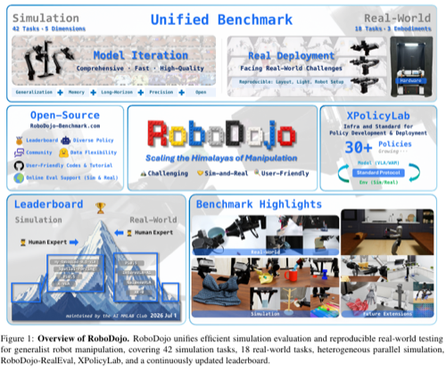 | [RoboDojo](https://arxiv.org/abs/2607.04434) | 2026 | Isaac Sim / real robot | Unified benchmark with 42 simulation and 18 real-world tasks evaluating generalization, memory, precision, long-horizon execution, and open-vocabulary instruction following. |
| 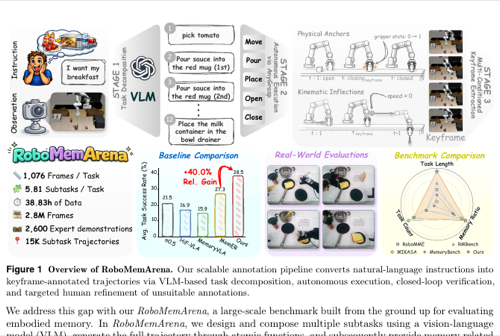 | [RoboMemArena](https://arxiv.org/abs/2605.10921) | 2026 | Simulation / real robot | 26 long-horizon tasks with keyframe annotations and paired real-world evaluations for testing memory across transferring, occlusion, counting, and sequential execution. |
| 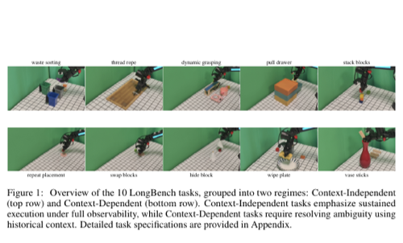 | [LongBench](https://arxiv.org/abs/2604.16788) | 2026 | Real robot (ARX-R5) | Real-world long-horizon manipulation benchmark with 1,000 demonstrations separating execution robustness from history-dependent contextual reasoning. |
|  | [CaP-X](https://arxiv.org/abs/2603.22435) | 2026 | MuJoCo / Isaac Sim | Code-as-policy robot-manipulation benchmark with 100+ tasks evaluating LLMs/VLMs generating control code from natural language. |
| 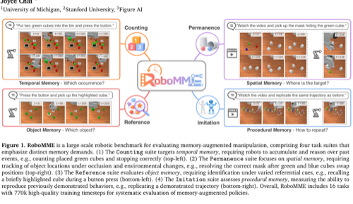 | [RoboMME](https://arxiv.org/abs/2603.04639) | 2026 | SAPIEN (ManiSkill) | 16 history-dependent manipulation tasks isolating temporal, spatial, object-reference, and procedural memory in generalist robot policies. |
|  | [KinDER](https://prpl-group.com/kinder-site/) | 2026 | PyBullet, MuJoCo, Pymunk | 25 procedurally-generated 2D/3D environments isolating kinematic and dynamic physical reasoning challenges. |
| 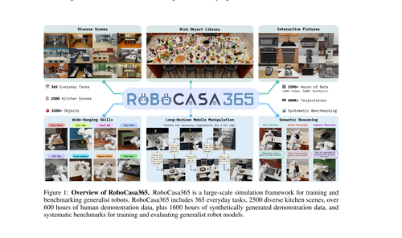 | [RoboCasa365](https://arxiv.org/abs/2603.04356) | 2026 | MuJoCo (robosuite) | 365 kitchen tasks across 2,500 scenes and 2,200+ hours of demonstrations, including composite and held-out task compositions for generalist policies. |
| 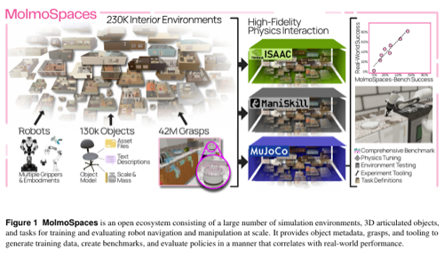 | [MolmoSpaces](https://arxiv.org/abs/2602.11337) | 2026 | MuJoCo | Open ecosystem and eight-task benchmark spanning 230,000+ indoor environments and 130,000 objects for large-scale manipulation and navigation generalization. |
| 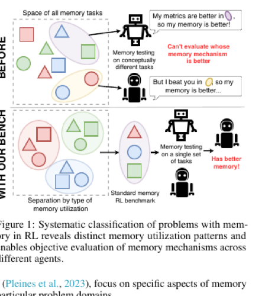 | [MIKASA-Robo](https://arxiv.org/abs/2502.10550) | 2026 | SAPIEN (ManiSkill3) | 32 tabletop manipulation tasks across 12 categories testing object, spatial, sequential, and capacity-related memory under partial observability. |
| 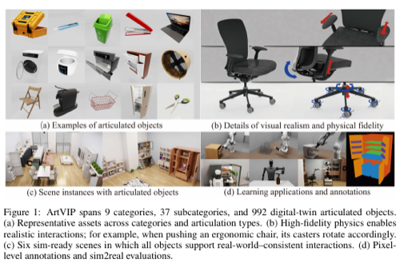 | [ArtVIP](https://arxiv.org/abs/2506.04941) | 2026 | Isaac Sim | Dataset of 992 physically tuned digital-twin articulated objects with modular triggered interactions, six scenes, and manipulation tasks for physical-fidelity and sim-to-real evaluation. |
| 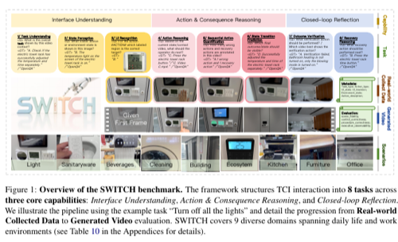 | [SWITCH](https://arxiv.org/abs/2511.17649) | 2025 | Real-world egocentric video | Multimodal benchmark built from 1,170 videos of tangible interfaces, testing grounding, action and state-transition prediction, outcome verification, and recovery reasoning. |
|  | [VLMgineer](https://arxiv.org/abs/2507.12644) | 2025 | PyBullet | Framework using VLMs with evolutionary search to co-design physical tools and action plans. |
| 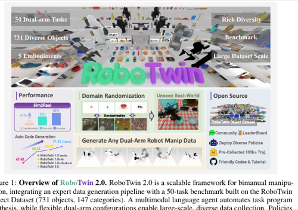 | [RoboTwin 2.0](https://arxiv.org/abs/2506.18088) | 2025 | SAPIEN | 50 dual-arm tasks across five robot embodiments with strong visual, object, scene, and language randomization for robust bimanual manipulation. |
| 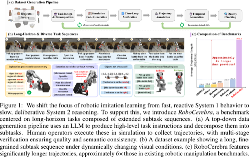 | [RoboCerebra](https://arxiv.org/abs/2506.06677) | 2025 | MuJoCo (LIBERO) | Long-horizon household manipulation benchmark evaluating high-level VLM planning, reflection, and memory over extended subtask sequences. |
|  | [VLABench](https://arxiv.org/abs/2412.18194) | 2025 | MuJoCo (dm_control) | 100 language-conditioned manipulation task categories evaluating VLAs on long-horizon reasoning and world knowledge. |
|  | [OGBench](https://arxiv.org/abs/2410.20092) | 2025 | MuJoCo | Offline goal-conditioned RL benchmark with 8 environments probing stitching and long-horizon reasoning. |
|  | [ManiSkill-HAB](https://arxiv.org/abs/2412.13211) | 2025 | SAPIEN / PhysX (ManiSkill3) | GPU-accelerated low-level manipulation benchmark for in-home object rearrangement with RL/IL baselines. |
|  | [EmbodiedBench](https://arxiv.org/abs/2502.09560) | 2025 | AI2-THOR, Habitat, CoppeliaSim | 1,128 tasks across four environments evaluating multi-modal LLMs as vision-driven embodied agents. |
| 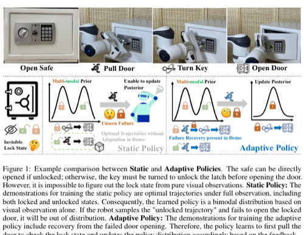 | [AdaManip](https://arxiv.org/abs/2502.11124) | 2025 | Isaac Gym | Adaptive-manipulation environment with 277 articulated objects across nine categories and five hidden mechanism types requiring trial-and-error recovery. |
| 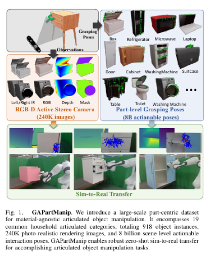 | [GAPartManip](https://arxiv.org/abs/2411.18276) | 2024 | Isaac Sim / real robot | Part-centric dataset with 918 objects in 19 household categories, 240,000 rendered images, and eight billion actionable interaction poses for sim-to-real manipulation. |
| 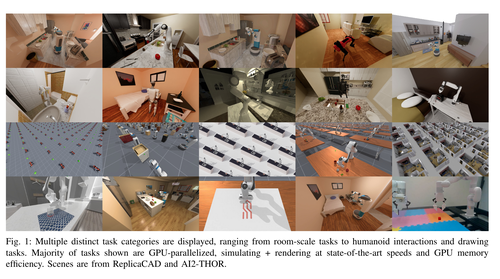 | [ManiSkill3](https://arxiv.org/abs/2410.00425) | 2024 | SAPIEN / PhysX | GPU-parallelized manipulation simulator and benchmark rendering 20+ task categories at 30,000+ FPS for generalizable embodied AI. |
|  | [RoboCasa](https://arxiv.org/abs/2406.02523) | 2024 | MuJoCo (robosuite) | Large-scale kitchen-focused simulation with 100 tasks and diverse assets for generalist robots. |
|  | [Kinetix](https://arxiv.org/abs/2410.23208) | 2024 | Jax2D (JAX) | Open-ended procedurally-generated 2D physics-based tasks for training general RL agents. |
|  | [I-PHYRE](https://arxiv.org/abs/2312.03009) | 2024 | Pymunk (Chipmunk2D) | Interactive physical reasoning requiring intuitive physics, multi-step planning, and in-situ intervention. |
|  | [Embodied Agent Interface](https://arxiv.org/abs/2410.07166) | 2024 | OmniGibson, VirtualHome | Unified interface benchmarking LLM modules (goals, subgoals, actions, transitions) for embodied decision making. |
|  | [DittoGym](https://arxiv.org/abs/2401.13231) | 2024 | Taichi (MPM) | RL benchmark for reconfigurable soft robots requiring fine-grained morphology changes within an episode. |
|  | [BEHAVIOR-1K](https://arxiv.org/abs/2403.09227) | 2024 | OmniGibson (Omniverse/PhysX 5) | 1,000 household activities combining navigation and mobile manipulation with articulated objects, deformables, fluids, and realistic physics. |
| 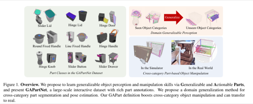 | [GAPartNet](https://arxiv.org/abs/2211.05272) | 2023 | SAPIEN / real robot | Interactive dataset and benchmark with 8,489 actionable-part instances on 1,166 objects, evaluating cross-category segmentation, pose estimation, and manipulation. |
| 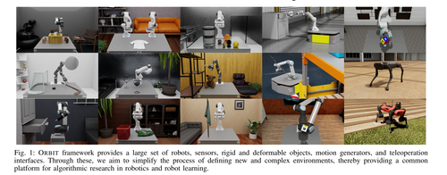 | [Isaac Lab (Orbit)](https://arxiv.org/abs/2301.04195) | 2023 | Isaac Sim (PhysX 5) | GPU-accelerated unified simulation framework with photorealistic rendering and modular environments for interactive robot learning. |
|  | [LIBERO](https://arxiv.org/abs/2306.03310) | 2023 | MuJoCo (robosuite) | Lifelong manipulation benchmark with spatial, object, goal, and 10 multi-stage LIBERO-Long tasks for knowledge transfer and long-horizon VLA evaluation. |
|  | [FurnitureBench](https://arxiv.org/abs/2305.12821) | 2023 | Isaac Gym | Reproducible real-world furniture assembly benchmark for long-horizon complex robot manipulation. |
| 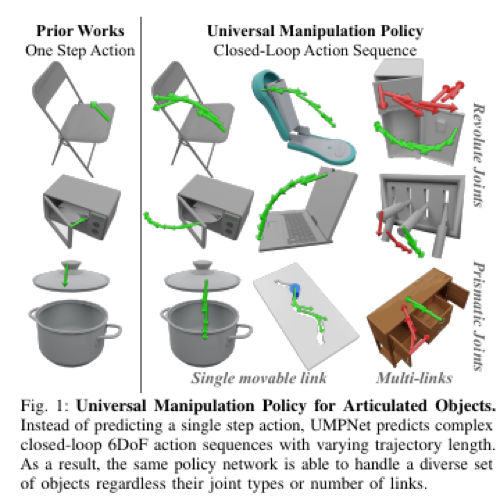 | [UMPNet](https://arxiv.org/abs/2109.05668) | 2022 | PyBullet | PartNet-Mobility benchmark for self-guided open-ended state exploration and goal-conditioned manipulation of unseen articulated objects and categories. |
|  | [ProcTHOR](https://arxiv.org/abs/2206.06994) | 2022 | AI2-THOR (Unity) | Procedurally generates large-scale interactive houses for embodied-AI navigation, rearrangement, and manipulation. |
|  | [CALVIN](https://arxiv.org/abs/2112.03227) | 2021 | PyBullet | Language-conditioned manipulation benchmark evaluating 1,000 chains of five consecutive skills from onboard visual and proprioceptive observations. |
| 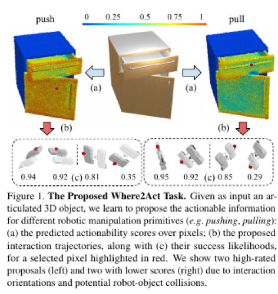 | [Where2Act](https://arxiv.org/abs/2101.02692) | 2021 | SAPIEN | Learning-from-interaction benchmark over 972 PartNet-Mobility objects in 15 categories for predicting where and how to push or pull movable parts. |
|  | [ALFRED](https://arxiv.org/abs/1912.01734) | 2020 | AI2-THOR (Unity) | Grounded natural-language instructions mapped to egocentric action sequences for household tasks. |
|  | [robosuite](https://arxiv.org/abs/2009.12293) | 2020 | MuJoCo | Modular MuJoCo-powered simulation framework with standardized robot-manipulation benchmark environments for reproducible robot learning. |
| 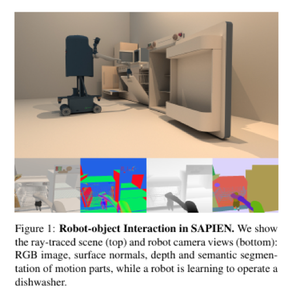 | [SAPIEN / PartNet-Mobility](https://arxiv.org/abs/2003.08515) | 2020 | SAPIEN (PhysX) | Physics-rich simulator and benchmark built around 2,346 articulated objects in 46 categories, supporting part perception, motion-attribute recognition, and robotic interaction. |
| 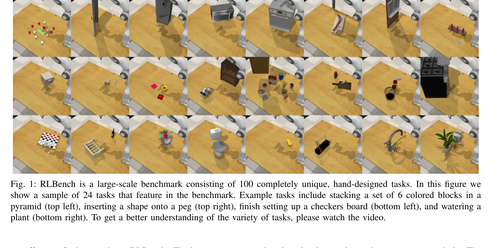 | [RLBench](https://arxiv.org/abs/1909.12271) | 2019 | CoppeliaSim (PyRep) | 100 unique hand-designed manipulation tasks with demonstrations for benchmarking imitation, reinforcement, and few-shot learning. |
|  | [Habitat](https://arxiv.org/abs/1904.01201) | 2019 | Habitat-Sim (Magnum) | High-performance photorealistic 3D simulator for embodied navigation, instruction following, and question answering. |
|  | [PHYRE](https://arxiv.org/abs/1908.05656) | 2019 | Box2D | 2D classical-mechanics puzzles benchmarking sample-efficient physical reasoning. |
|  | [DM Control](https://arxiv.org/abs/1801.00690) | 2018 | MuJoCo | MuJoCo-powered continuous-control tasks with standardized structure; de facto RL benchmark. |
|  | [AI2-THOR](https://arxiv.org/abs/1712.05474) | 2017 | Unity (PhysX) | Near-photorealistic interactive 3D indoor scenes for visual AI, navigation, and object interaction. |

---

## Computer Use

Benchmarks for agents that interact with software — browsers, desktop GUIs, terminals, and codebases.

| Preview | Name | Year | Description |
| --- | --- | --- | --- |
|  | [BrowseComp](https://openai.com/index/browsecomp/) | 2025 | 1,266 short-answer questions requiring persistent browsing for hard-to-find, entangled information. |
|  | [TheAgentCompany](https://arxiv.org/abs/2412.14161) | 2024 | Simulated software company evaluating agents on end-to-end professional workplace tasks. |
|  | [τ-bench](https://arxiv.org/abs/2406.12045) | 2024 | Simulated user–agent conversations testing tool use and policy adherence (retail, airline). |
|  | [AndroidWorld](https://arxiv.org/abs/2405.14573) | 2024 | 116 dynamic, parameterized tasks across 20 real Android apps. |
|  | [OSWorld](https://arxiv.org/abs/2404.07972) | 2024 | 369 real computer tasks across Ubuntu, Windows, and macOS for multimodal agents. |
|  | [WorkArena](https://arxiv.org/abs/2403.07718) | 2024 | 33 ServiceNow-based enterprise tasks evaluating knowledge-worker web agents via BrowserGym. |
|  | [VisualWebArena](https://arxiv.org/abs/2401.13649) | 2024 | Realistic visually-grounded web tasks for evaluating multimodal agents. |
|  | [GAIA](https://arxiv.org/abs/2311.12983) | 2023 | Real-world assistant questions requiring reasoning, multimodality, web browsing, and tool use. |
|  | [SWE-bench](https://arxiv.org/abs/2310.06770) | 2023 | 2,294 real GitHub issues from 12 Python repos requiring multi-file code edits. |
|  | [AgentBench](https://arxiv.org/abs/2308.03688) | 2023 | Multi-dimensional LLM-as-agent evaluation across 8 distinct interactive environments. |
|  | [WebArena](https://arxiv.org/abs/2307.13854) | 2023 | Self-hostable realistic multi-site web environments for reproducible agent evaluation. |
|  | [Mind2Web](https://arxiv.org/abs/2306.06070) | 2023 | Generalist web-agent tasks spanning 137 real websites across 31 domains. |
|  | [WebShop](https://arxiv.org/abs/2207.01206) | 2022 | Simulated e-commerce site with 1.18M products for instruction-following shopping agents. |
|  | [MiniWoB++](https://proceedings.mlr.press/v70/shi17a.html) | 2017 | Low-level keyboard/mouse web tasks with crowdsourced demos; foundational GUI-agent benchmark. |

---

## Contributing

PRs welcome. Please:
- Link the benchmark **Name** to its paper or primary reference.
- Keep the description to one or two sentences.
- Preserve reverse chronological order within each table.

---

## Related Work

Several curated lists overlap with this collection but emphasize different slices of the agent-evaluation landscape:

- [Awesome-General-Agents-Benchmark](https://github.com/supernalintelligence/Awesome-General-Agents-Benchmark) — 50+ benchmarks across general reasoning, agent tasks, domain skills (math/science/coding/web), multimodal, and safety; annotated with top-performer scores and human baselines.
- [awesome-ai-benchmarks](https://github.com/panilya/awesome-ai-benchmarks) — 114+ entries spanning programming, multimodal, translation, agent reasoning, and creative evaluation; paired with a searchable site at [aibenchmarks.net](https://aibenchmarks.net).
- [ai-agent-benchmark-compendium](https://github.com/philschmid/ai-agent-benchmark-compendium) — 50+ benchmarks for function-calling/tool use, general assistant/reasoning, coding, and computer interaction; heavy overlap with our *Computer Use* table.
- [Awesome-Robotic-Benchmarks](https://github.com/HaoranZhangumich/Awesome-Robotic-Benchmarks) — 30+ robotics benchmarks covering manipulation, locomotion, navigation, HRI, safety, simulation, and generalist tasks; finer sub-categories than our *Robotics* table.

In contrast, this list is scoped to **interactive decision-making environments**, with a focus on games, robotics, and computer use.
